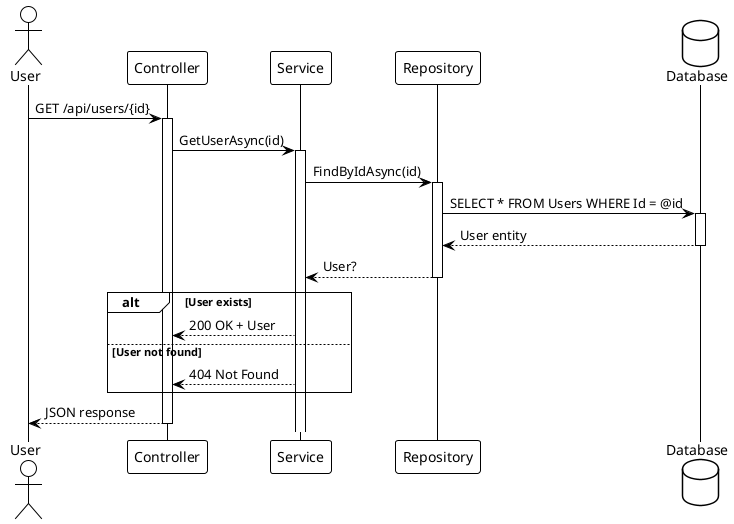
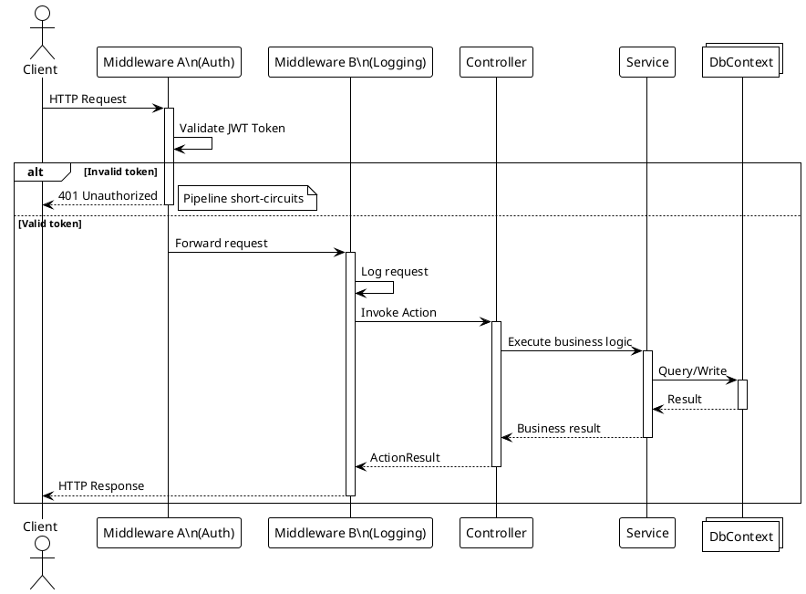
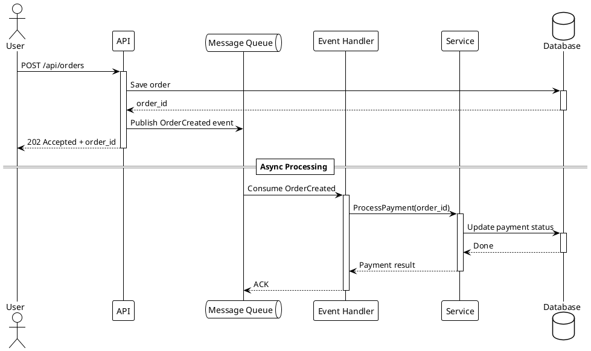
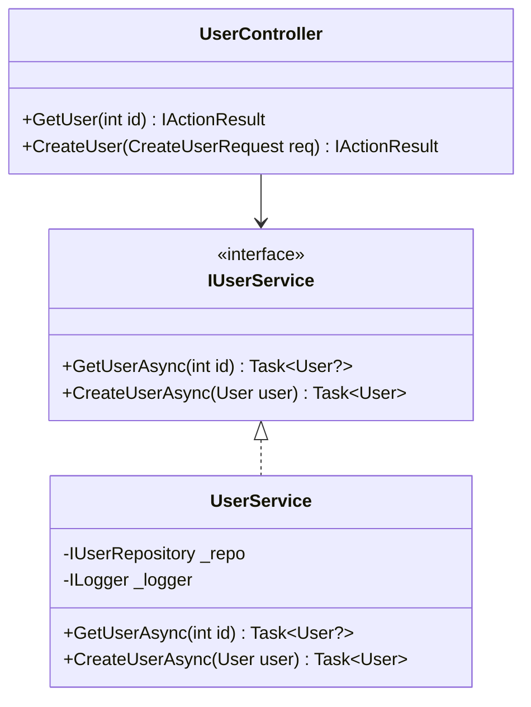
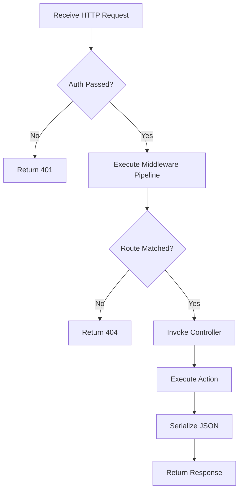

# Software Engineering Analysis

## Responsibility

Produce rigorous software engineering analysis documentation. Use **PlantUML** for API call sequence diagrams, **Mermaid** for class hierarchies and architecture flowcharts, and **KaTeX** for algorithm complexity.

## Mandatory Rules

- Every code snippet **must come from an actual file**, with file path and line range noted
- All diagrams must pass syntax validation (Mermaid/PlantUML/KaTeX)
- Do not fabricate method signatures, class names, or execution flows
- If code is inferred (no example available), it must be explicitly marked as such

## Page Plan

| Page | Content | Rendering |
|---|---|---|
| `01_project_structure/index.md` | Module map, package dependency graph | Mermaid flowchart + tables |
| `02_class_hierarchy/index.md` | Core types, interfaces, inheritance | Mermaid classDiagram |
| `03_startup_flow/index.md` | Bootstrap sequence, DI registration | PlantUML sequence diagram |
| `04_request_lifecycle/index.md` | Request→response full pipeline | PlantUML sequence + flowchart |
| `05_api_sequences/index.md` | API call sequences (core business scenarios) | **PlantUML** |
| `06_data_flow/index.md` | State changes, event-driven, messaging | Mermaid flowchart |
| `07_dependencies/index.md` | External dependencies, middleware, third-party | Tables + architecture diagram |

## API Call Sequence Diagrams (PlantUML)

This is the **core deliverable** of this skill. For each core API endpoint, produce a PlantUML sequence diagram showing the complete call chain.

### Basic REST API Scenario

### With Middleware Pipeline

### Async/Event-Driven Scenario

### PlantUML Syntax Validation Checklist

- [ ] `@startuml` / `@enduml` are paired
- [ ] All participants (`actor` / `participant` / `database` / `queue` / `collections`) are declared before use
- [ ] `activate` / `deactivate` are paired with no omissions
- [ ] `alt` / `else` / `end` block structure is correct
- [ ] `note right` / `note left` have clear scope
- [ ] `== Section Title ==` is used for phase separation

## Class Diagram (Mermaid)

> Source: `src/MyApp.Web/Services/UserService.cs` lines 15-45

## Flowchart (Mermaid)

## Output Location

`content/{lang}/{Project}/architecture/`

## Post-Write Action

After writing SE Analysis content:

- [ ] **Regenerate navigation index** — Run the tree generator script (e.g. `python gen_tree.py`) to rebuild tree.json
- [ ] **Build the project** — Run `dotnet build` to verify the new content embeds correctly
