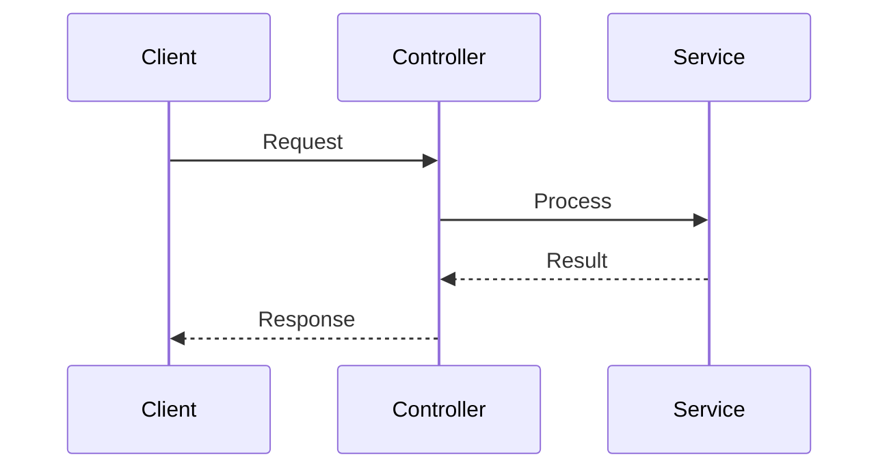
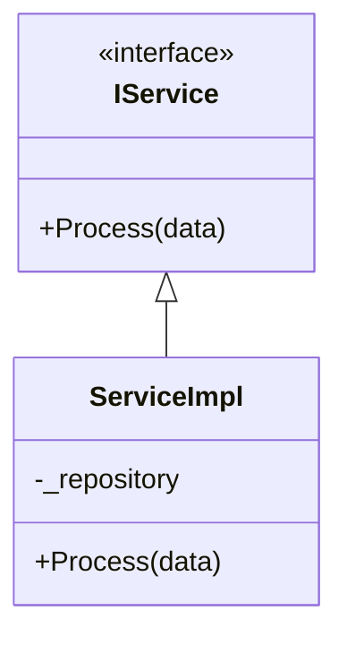
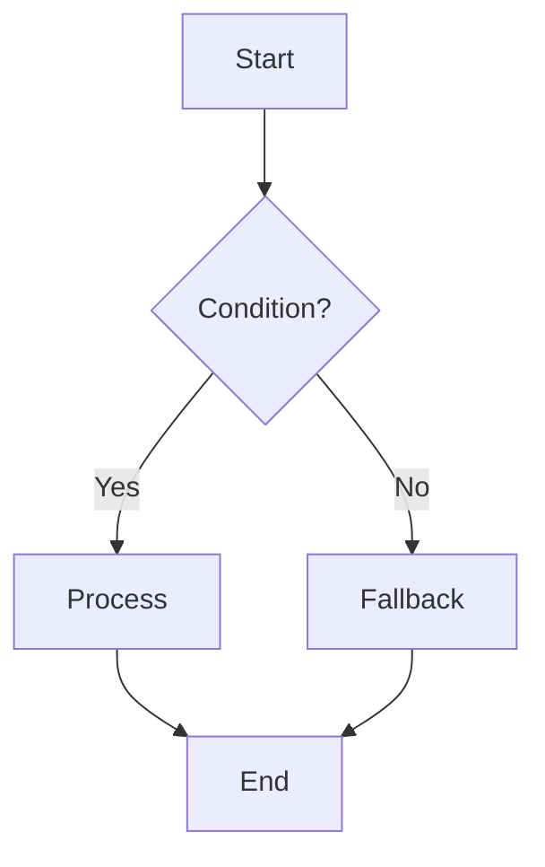

# SE Analysis — Software Engineering Analysis & Wiki Documentation

> **Sub-skill.** Load only when the user asks to perform a software engineering analysis on an external repository.
> **Default path phase: Phase 3**
> **Prerequisite:** Phases 1 (repo-reading) and 2 (api-docs) complete

Performs professional software engineering analysis including architecture, class hierarchies, execution sequences, and API flows, rendered using Mermaid diagrams, PlantUML, and KaTeX.

## When to Load

- "Software engineering analysis"
- "Draw architecture diagram"
- "Analyze source code flow"
- "Create class hierarchy documentation"
- "Document request lifecycle"

## Analysis Dimensions

| Dimension | Output Format | Cloud Glyph Rendering |
|---|---|---|
| Project structure | Directory tree + module descriptions | Markdown lists |
| Class/inheritance relationships | Class diagram | ` ```mermaid classDiagram ` |
| Execution flow | Sequence diagram | ` ```mermaid sequenceDiagram ` |
| Component architecture | Architecture diagram | ` ```mermaid flowchart ` or PlantUML |
| API execution process | Request-response sequence + code references | Sequence diagram + code blocks |
| Algorithm/complexity | Formulas | KaTeX `$$...$$` |

## Standard Analysis Deliverables

Create the following pages under `content/{lang}/{Project}/architecture/`:

| Page | Content | Recommended Rendering |
|---|---|---|
| `index.md` | Project overview, tech stack summary | Tables + lists |
| `01_project_structure.md` | Directory structure, module division, dependencies | Directory tree + Mermaid arch diagram |
| `02_class_hierarchy.md` | Core class/interface inheritance and implementation | Mermaid class diagram |
| `03_startup_flow.md` | Application startup, DI registration | Mermaid sequence diagram |
| `04_request_lifecycle.md` | Full request processing pipeline | Mermaid flowchart + sequence diagram |
| `05_key_scenarios.md` | Critical business scenario execution paths | Sequence diagram + code references |
| `06_data_flow.md` | Data flow, state changes, event-driven patterns | Mermaid flowchart |
| `07_dependencies.md` | External dependencies, middleware, third-party integrations | Tables + architecture diagram |

## Mermaid Usage Examples

```markdown
<!-- Sequence Diagram -->


<!-- Class Diagram -->


<!-- Flowchart -->

```

## Diagram Validation Checklist

> **Mandatory.** Every diagram written in analysis deliverables MUST pass the following checks before the document is committed. Invalid diagrams silently fail to render, degrading documentation quality.

### Mermaid Validation

- [ ] **Direction/type** matches content — `flowchart` for processes, `sequenceDiagram` for interactions, `classDiagram` for types
- [ ] **Arrow operators** are valid — `->>` for async call, `-->>` for async return, `-x` for lost message, `--) ` for done
- [ ] **All participants declared** in sequence diagrams before being referenced in arrows
- [ ] **Brackets balanced** — `{}` `[]` `()` are properly paired, no unclosed nesting
- [ ] **Keywords lowercase** — `participant`, `loop`, `alt`, `opt`, `rect`, `activate`, `deactivate`
- [ ] **Indentation consistent** — `loop`/`alt`/`opt` blocks are indented uniformly to show scope
- [ ] **Labels escaped** — `"` `(` `)` inside node text use consistent wrapping (e.g., `B{Condition?}` or `B["Condition?"]`)
- [ ] **No dangling edges** — every arrow has both a source and a target node that exist

### PlantUML Validation

- [ ] **`@startuml` / `@enduml`** present and balanced — one opening, one closing
- [ ] **Participants declared** — `actor`, `participant`, `boundary`, `control`, `entity` defined before use
- [ ] **Arrow direction explicit** — `->` `-->` `-down->` `-right->` `-left->` where direction matters
- [ ] **Brackets balanced** — `{}` `[]` `()` properly paired
- [ ] **Skinparam syntax** — `skinparam` lines use correct parameter names (e.g. `skinparam backgroundColor`)

### Pre-Commit Verification

Before finalizing, the agent MUST:

1. **Mentally trace** each diagram's logic — walk through every arrow and verify connectivity
2. **Re-read** the raw code block as if parsing it — catch missing brackets, misspelled keywords, unclosed blocks
3. **Verify against the rendering target** — ensure the diagram type is supported by AvalonMarkdown v4.0 (Mermaid 11 + PlantUML encoder)

