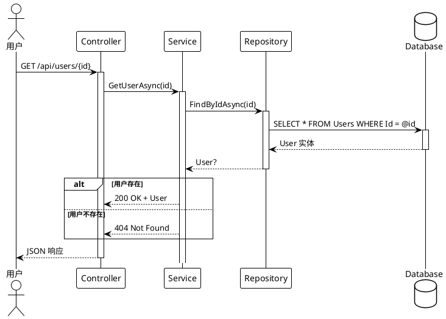
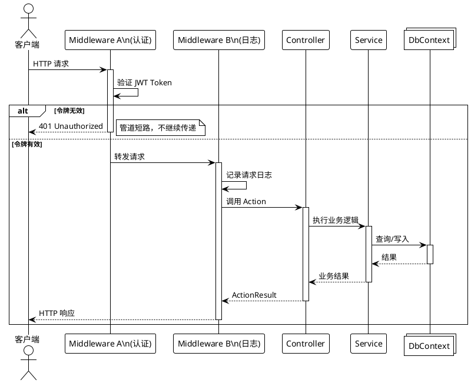
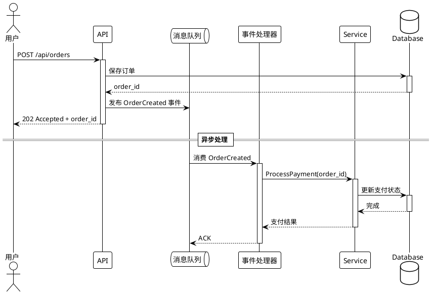
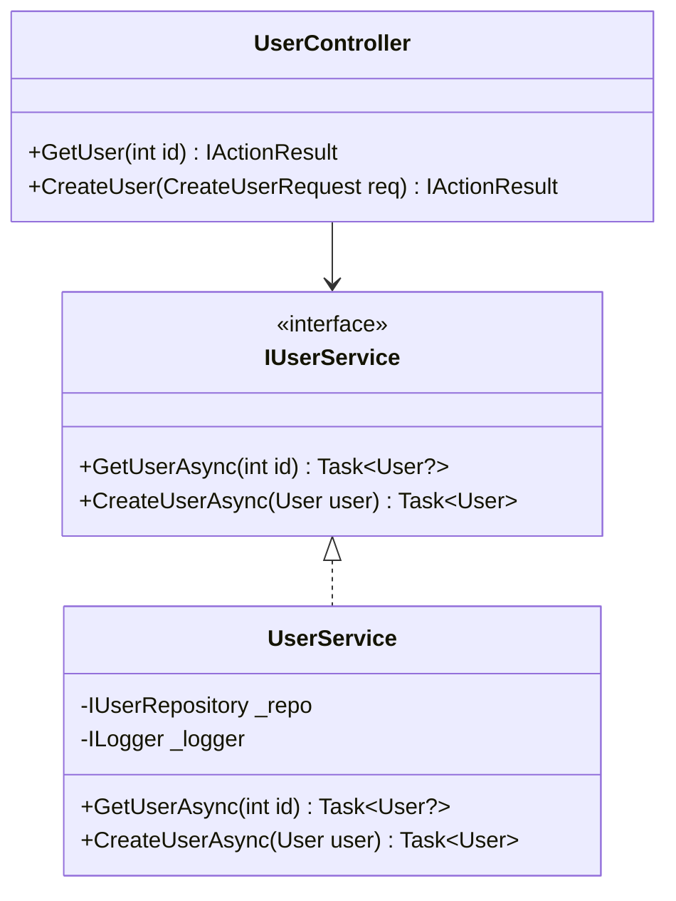
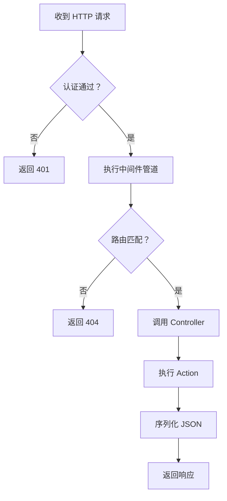

# 软件工程分析

## 职责

产出严谨的软件工程分析文档。使用 **PlantUML** 描绘 API 调用时序图，用 **Mermaid** 展示类层次、架构流程图，用 **KaTeX** 表达算法复杂度。

## 强制性规则

- 每一个代码片段**必须来自实际文件**，并注明文件路径和行范围
- 所有图必须通过语法验证（Mermaid/PlantUML/KaTeX）
- 禁止编造方法签名、类名或执行流
- 如果代码是推断的（无示例可用），必须用标注明确注明

## 页面规划

| 页面 | 内容 | 渲染方式 |
|---|---|---|
| `01_project_structure/index.md` | 模块地图、包依赖图 | Mermaid flowchart + 表格 |
| `02_class_hierarchy/index.md` | 核心类型、接口、继承关系 | Mermaid classDiagram |
| `03_startup_flow/index.md` | 引导序列、DI 注册 | PlantUML 时序图 |
| `04_request_lifecycle/index.md` | 请求→响应完整管道 | PlantUML 时序图 + flowchart |
| `05_api_sequences/index.md` | API 调用时序（核心业务场景） | **PlantUML** |
| `06_data_flow/index.md` | 状态变化、事件驱动、消息传递 | Mermaid flowchart |
| `07_dependencies/index.md` | 外部依赖、中间件、第三方集成 | 表格 + 架构图 |

## API 调用时序图（PlantUML）

这是本技能的**核心交付物**。对于每个核心 API 端点，产出一张 PlantUML 时序图，展示完整的调用链路。

### 基本 REST API 场景

### 含中间件管道

### 异步/事件驱动场景

### PlantUML 语法验证清单

- [ ] `@startuml` / `@enduml` 成对出现
- [ ] 所有参与者（`actor` / `participant` / `database` / `queue` / `collections`）在使用前声明
- [ ] `activate` / `deactivate` 成对匹配，无遗漏
- [ ] `alt` / `else` / `end` 块结构正确
- [ ] `note right` / `note left` 有明确作用域
- [ ] `== 分隔标题 ==` 用于阶段分隔

## 类图（Mermaid）

> 来源: `src/MyApp.Web/Services/UserService.cs` 第 15-45 行

## 流程图（Mermaid）

## 输出位置

`content/{lang}/{Project}/architecture/`

## 写入后操作

编写软件工程分析内容后：

- [ ] **重新生成导航索引** — 运行树生成脚本（如 `python gen_tree.py`）重建 tree.json
- [ ] **构建项目** — 运行 `dotnet build` 验证新内容正确嵌入

